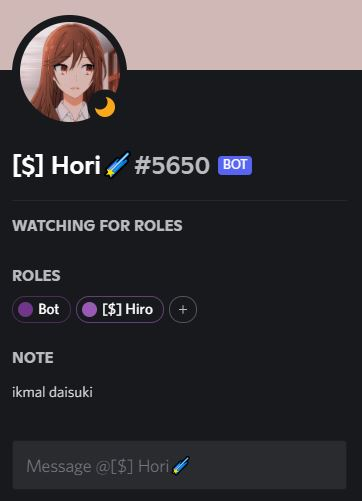

# DiscordRoleReactionBot 🌌
[DiscordReactionBot] is a bot created with Node Js that will give you role based on your emoji reaction 

created by @icyurei or @ikxmleo [LuneChain]

donate me some ETH

0xa01A95878447dfbCdb47d85ed6898C1d241Af5d6⠀

How to run

1) npm init -y 
2) npm install dotenv 
3) npm install discord.js
4) npm install discord-rpc
5) copy app.js content to yours
6) node app.js
7) done

Output in Discord Roles Channel

Output on Discord RPC

